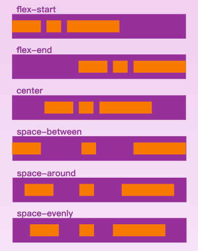
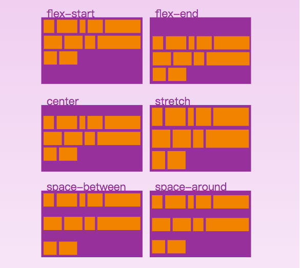

# FlexBox 完全指南
其实对于如何布局ui，让某个元素居中一直让我很头疼，今天看到了这个flexBox，这个旨在提供一个更有效的方式来布置，调整元素在一个容器中分布的空间，改变元素的宽度/高度还有顺序，以最好滴填充可用空间（其实主要是为了适应所有类型的显示设备）。<br>
flexbox布局与方向无关，并不是常规的布局（基于垂直块和给予水平块的内联块）。<br>
**这里要着重说明的一点** ❕ flexbox布局适用于应用程序的组件和小规模布局，而Grid布局则适用于更大规模的布局。接下来会有grid布局的介绍[]()<br>
### 基础知识和术语
container和items<br>
<br>
#### display
```css
.container{
  display:flex;
}
```
CSS列对flex容器没有影响<br>
#### flex-direction
这里建立了主轴，从而定义了flex项放置在flex容器中的方向。Flexbox是单向布局概念。可以将弹性项目视为主要布置在水平行或垂直列中。
<br>
```css
.container{
  flex-direction:row|row-reverse|column|column-reverse;
}
```
* row（默认）: 从左到右 ltr；从右到左rtl<br>
* row-reverse: 从左到右 ltr；从右到左rtl<br>
* column: 同样row，但从上到下<br>
* column: 同样row-reverse 但从下到上<br>
效果代码：    <br>

#### flex-wrap
默认情况下，flex都会尝试适合一行。您可以更改它并允许项目根据需要使用此属性进行换行。<br>
```css
.container{
  flex-wrap:nowrap|wrap|wrap-reverse;
}
```
* nowrap(默认值)：所有弹性项目都在一行上<br>
* wrap：flex项目将从上到下包裹到多行。<br>
* wrap-reverse: flex将从下到上包裹多行。<br>
#### flex-flow(parent flex container元素)
这个简写了flex-direction和flex-wrap属性，他们共同定义了flex容器的主轴和交叉轴。默认是 `row nowrap`<br>
```css
.container{
  flex-flow: row nowrap;
}
```
#### justify-content
这定义了沿主轴对齐。

```css
.container{
  justify-content:flex-start ...
}
```
* flex-start （默认值）：项目朝向起始行打包
* flex-end：物品被打包到终点线
* center：项目沿着线居中
* space-between：物品均匀分布在线上; 第一项是在起始行，最后一项是在结束行
* space-around：项目均匀分布在行周围，空间相等。请注意，在视觉上空间不相等，因为所有项目在两侧都有相等的空间。第一个项目将在容器边缘上有一个空间单位，但在下一个项目之间有两个单位的空间，因为下一个项目有自己适用的间距。
* space-evenly：项目是分布的，以便任何两个项目之间的间距（和边缘的空间）相等。
#### align-items
这定义了如何沿着当前行的横轴布置flex的默认行为。可以视为`justify-content`横轴的版本（垂直于主轴）。<br>
<br>
```css
.container{
  align-items:flex-start;
}
```
* flex-start：项目的交叉开始边缘放置在交叉起始线上
* flex-end：项目的跨端边距边缘放在十字线上
* center：项目以横轴为中心
* baseline：项目已对齐，例如其基线对齐
* stretch （默认）：拉伸以填充容器（仍然遵循最小宽度/最大宽度）
#### align-content
当横轴上有额外空间时，这会对齐flex容器的线条，类似于justify-content在主轴内对齐各个项目的方式。<br>

```css
.container{
  align-content:flex-start;
}
```
* flex-start：行打包到容器的开头
* flex-end：行打包到容器的末尾
* center：行包装到容器的中心
* space-between：线条均匀分布; 第一行是容器的开头，而最后一行是在最后一行
* space-around：线条均匀分布，每条线周围的空间相等
* stretch （默认值）：线条拉伸以占用剩余空间
