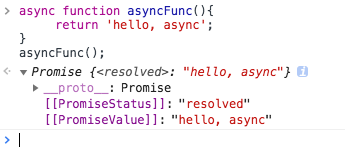

## 好文好读，async/await，解决回调
先介绍一下语法<br>
<br>
然后我们稍微描述一下<br>
### 描述
当调用一个async函数时，会返回一个Promise对象。当这个async函数返回一个值时，Promise的resolve方法会负责传递这个值；当async函数抛出异常时，Promise的reject方法也会传递这个异常值。<br>
async函数可能会有await表达式，这会使async函数暂停执行，等待表达式中的Promise解析完成后继续执行async函数并返回解决结果<br>
⚠️ await关键字仅仅在async function中有效。如果在async function函数体外使用await，你会得到一个语法错误❌（SyntaxError）<br>
📒 其实async/await的用途是简化使用promises异步调用的操作，并对一组Promises执行某些操作。正如Promises类似于结构化回调，async/await类似于组合生成器和promises。<br>
## async是啥？
看一个截图吧<br>
<br>
async声明的function就表示这是一个异步函数，返回的是一个promise对象，状态为resolved，参数是return的值。就是hello,async<br>
那么接下来又看一个截图吧<br>
<br>
这里首先是first然后是after。<br>
综上所述，async定义的函数内部会默认返回一个promise对象，如果函数内部抛出异常或者是返回reject，都会使函数的promise状态为reject。<br>
那么，如果失败态呢？我们尝试抛出一个失败态。
<br>
这里看到我们的函数内部，我们故意抛出了一个异常，返回reject，at err，asycn收到之后就去catch，catch就打印出来了。<br>
如果async函数接受到返回的值，发现不是异常或者reject，则判定成功，这里可以return各种数据类型的值，false,NaN,undefined...都是resolve。<br>
但是返回如下结果，就会判定失败reject:<br>
@ 内部含有直接使用并且未声明的变量或函数。<br>
@ 内部抛出一个错误`throw new Error` 或者返回 `reject`状态 `return Promise.reject('failure')`<br>
@ 函数方法执行出错...
在async使用上，必须将结果返回，不然不管执行`reject`还是`resolved`的值都为`undefine`，建议使用箭头函数<br>
```js
async function PromiseError(){
    return Promise.reject('error,promise');
}
// correct ，必须将reject状态return出去
```
## await是啥？
异步等待（async wait)。任何async函数都会默认返回promise，并且这个rpmise解析的值都将会示这个函数的返回值，而async函数必须等待内部所有的await命令的Promise对象执行完，才会发生状态改变。<br>
打个比方：await是美女，async是老司机，老司机必须等美女齐了再开车<br>
```


