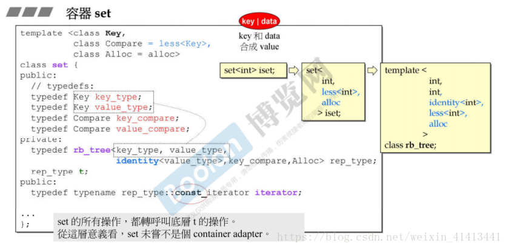
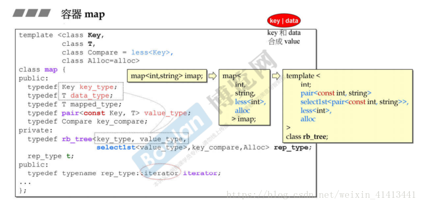

### 札记 面试题集锦
最近真的要准备面试了，不能继续深挖某某知识点了😄，看到这些问题，自己答一遍，加深印象。
#### 字节对齐以及为什么要字节对齐？字节对齐的相关规则？
在我遇到的字节对齐的相关知识点是struct和union。字节对齐使得内存空间使用更大，不用浪费空间，char一般会分配1个字节，结合CPU访问的效率来说，对齐字节会对访问的效率更高，对齐存取效率会更高。OK，现在是标准答案。
1⃣️ 什么是字节对齐？<br>
看了那么多文章，其实总结了一下，什么是字节对齐。字节对齐就是在内存存储数据的时候是按照字节存储的，而字节存储是存在位置的，那就是内存，内存一般都会有地址，而地址是按顺序分高低位的。在结构中，编译器为结构的每个成员按其自然边界(aligment)分配空间。各个成员按照被声明的顺序在内存中顺序存储，第一个成员的地址就和整个结构的地址相同。然后按顺序，现代操作系统的cpu都是默认按4个字节访问内存。那么为了让cpu能够快速访问，一般，变量都会按照 **起始地址%sizeof(type) == 0**进行地址对齐，也就是字节对齐会让每个内存地址对应上每个字节的起始位置。如果当前成员的起始地址能被sizeof整除，就可以把数据存放在这；否则就得🉐️继续看下一个地址能不能被sizeof整除，直到找到合适的地址为止。不适合作为起始地址的空间将被空(lang)闲(fei)。<br>

[字节对齐与地址](../unixAdvance/img/sizeof.png)

现在计算机的内存空间都是按照byte划分的，从理论上讲似乎对任何类型的变量的访问可以从任何地址开始，但是实际情况是在访问特定类型变量的时候经常在特定的内存地址访问，就需要各种类型数据按照一定的规则在空间上排列，而不是顺序的一个接一个的排放。以上对齐。<br>

2⃣️ 为什么字节对齐，如果对齐CPU访问效率会更高<br>
好了，我们知道了字节对齐，那么为什么要字节对齐呢？为了提高cpu的访问内存的效率。为什么能提高cpu内存的访问效率呢？因为每次cpu访问内存的时候都需要以字节为单位进行访问。如果自然对齐，当然，cpu就能一次取出数据而不用通过剔除不要的数据，再次访问内存，然后在拼接成想要的数据，这就需要字节对齐的设计。
3⃣️ 字节对齐相关规则<br>
字节对齐的规则是什么呢？我们先来看一段代码<br>
```c
struct alig{
    char a;
    char b;
    int c;
}
```
首先a会放在第一个字节，那么就是0x00，而b会放在第二个字节0x01因为一个存储空间一个字节，地址可以按照 **起始地址%sizeof(type) == 0**公式来存放。那么int c占2个字节，地址会放在0x02很和谐。那么下面这个呢？
```c
struct alig1{
    double a;
    char b;
    int c;
}
```
根据以上的逻辑，double a会占8字节，从0x00-0x07，char b占一个字节，会占用0x08，int c占用两个字节，0x09与2求余不为0，继续找，找到了0x10，所以占了多少字节？8+1+1+2=12字节。<br>
所以规则就是按照 **起始地址%sizeof(type) == 0**公式计算地址位置。起始明白了，底层的数据存储格式，按照多少字节读取都是一样的计算方式。<br>
pragma就是告知cpu读取字节的模式，但是cpu
#### STL的了解情况（对顺序容器、关联型容器做了一些简单的介绍）
连续型容器:vector,array,heap,priotiry,list,slist,deque,stack,queue。<br>
关联容器: set,map,multiset,multimap,unordered map,unordered set。<br>
怎么介绍呢？介绍一下怎么写的，特性。<br>
所有容器都默认使用了默认分配器，它用new分配空间，delete释放空间，所以我们的先明白分配器到底是怎么回事！allocator到底是怎么回事呢？<br>
```cpp
/***allocator实现模型
 * ***/
template<typename T>
class allocator_{
    public:
        using size_type = size_t;

        template<typename U>
            using other = allocator_<U>;
        
        allocator_()noexcept;
        allocator_(const allocator_&)noexpect;

        template<typename U>
        allocator_(const allocator_<U>&)noexcept;

        ~allocator_();

        T* address(T& x)const noexpect;

        const T* address(const T&) const noexpect;

        T* allocate(size_t n,allocator_<void>::const T* hint=0); // 分配n个字节
        void deallocate(T* p,size_t n); // 释放n个字节

        size_t max_size()const noexpect;

        template<typename U,typename... Args>
        void construct(U* p,Args&&... args); // new(p)U{args}

        template<typename U>
            void distory(U* p); // p->~U()

};
```
所以它的实现目的是为给定类型提供内存资源以及提供在内存不再需要时将其归还的地方。allocator分配的内存都是未构造的，我们将在需要添加新元素时用allocator的construct成员在原始内存中创建对象。
```cpp
#include <memory>
#include <iostream>
#include <unordered_map>
using namespace std;

class Tesla{
    public:
        Tesla(int iinum,char cctr):inum(iinum),ctr(cctr){
            cout << "i am testla"<< ctr << iinum << endl;
        }
        void eat(){
            cout << "eat person" << endl;
        }
        virtual ~Tesla(){
            cout << "delete me" << inum << endl;
        }
    private:
        int inum;
        char ctr;
};

template<typename X,typename Y> ostream& operator<<(ostream &os,pair<X,Y>&p){
    return os<<'{'<<p.first<<','<<p.second<<'}';
}

int main(void){
    allocator<Tesla> tesla;
    auto const p = tesla.allocate(3);
    auto q = p;
    tesla.construct(q++,10,'n');
    tesla.construct(q++,30,'o');
    tesla.construct(q++,4,'p');
    tesla.destroy(--q);
    tesla.destroy(--q);
    tesla.destroy(--q);
    tesla.deallocate(p,3);// destory之后就是释放
    unordered_map<string,int> score1{{"andy",10},{"al",20},{"ba",30}};

    // cout << "haha" << endl;
    // for(const auto &x:score1){
    //     cout<< x << endl;
    // }
    return 0;
}
```
好了，allocator了解了，那么关于allocator的类型，其实并不多，只是告诉编译器，先分配内存，提高一些性能，然后不构造。好了挑几个重点介绍一下<br>
vector常用，先看一下vector的底层模版实现<br>
#### vector、list以及map、set这些的数据结构是怎么样的？（连续型内存，类似数组；红黑树）
先了解一下vector底层设计。<br>
vector是动态空间，随着元素的加入，内部机制会自动扩充以容纳新元素。<br>
首先是vector的源代码
```cpp
// alloc 是SGI STL的空间配置器
template<class T,class Alloc=alloc>
class vector{
   public:
     //vector的嵌套型别定义  其实使用using也是可以的
     typedef  T             value_type;
     typedef  value_type*   pointer;
     typedef  value_type*   iterator;
     typedef  value_type*   reference;
     typedef  size_t        size_type;
     typedef  ptrdiff_t     difference_type; 
   protected:
     //simple_alloc 是SGI STL的空间配置器
     typedef simple_alloc<value_type,Alloc> data_allocator;
     iterator start;//表示目前使用空间的头
     iterator finish;//表示目前使用空间的尾
     iterator end_of_storage;//表示目前可用空间的尾

     void insert_aux(iterator position,const T& x);
     void deallocate(){ // 解构造空间内存
         if(start)
            data_allocator::deallocate(start,end_of_storage-start);
     }

     void fill_initialize(size_type n,const T& value)
     {
         start=allocate_and_fill(n,value);
         finish=start+n;
         end_of_storage=finsih;
     }

  public:
     iterator begin(){return start;} // 根据内存分配的开始
     iterator end(){return finish;} // 结尾
     size_type size() const {return size_type(end()-begin());}
     size_type capacity() const {return size_type(end_of_storage-begin());}
     bool empty() const {return begin()==end();}
     reference operator[](size_type n) {return *(begin()+n);}

     vector():start(0),finish(0),end_of_storage(0){}
     vector(size_type n,const T& value){fill_initialize(n,value);}
     vector(int n,const T& value){fill_initialize(n,value);}
     vector(long n,const T& value){fill_initialize(n,value);}
     explicit  vector(size_type n){fill_initialize(n,T());} 

     ~vector(){
         destroy(start,finish);
         deallocate();
     }

     reference front(){return *begin();}//第一个元素
     reference back() {return *(end()-1);}//最后一个元素
     void push_back(const T& x){//将元素插入至最尾端
         if(finish!=end_of_storage){
             construct(finish,x);
             ++finish;
         }
         else
            insert_aux(end(),x);
     }

     void pop_back(){//将最尾端元素取出
         --finish;
         destroy(finish);//全局函数
     }

     iterator erase(iterator position){//清除某位置上的元素
         if(position+1 !=end)
         {
            copy(position+1,finish,position);//后续元素往前移动
         }
         --finish;
         destroy(finish);
         return position;
     }

     void resize(size_type new_size,const T& x) // 拷贝
     {
         if(new_size<size())
             erase(begin()+new_size,end());
         else
             insert(end(),new_size-size(),x);
     }
     // 重新扩容
     void resize(size_type new_size){resize(new_size,T());}
     void clear() {erase(begin(),end());}

 protected:
     //配置空间并填满内容
     iterator allocate_and_fill(size_type n,const T& x)
     {
         iterator result=data_allocator::allocate(n);
         uninitialized_fill_n(result,n,x);
         return result;
     }
};
```
当我们以push_back将新元素插入到vector尾端，该函数首先检查有没有备用空间，有就直接构造，并调整finish迭代器，使vector扩大，否则，重新配置，移动数据到新空间，释放原空间<br>
```cpp
void push_back(const T& x)
{
   if(finish!=end_of_storage)
   {
       //还有备用空间
       construct(finish,x);//全局函数
       ++finish;
   }
   else
   {
       insert_aux(end(),x);//vector member function
   }
}
```
大概insert_aux的实现如下
```cpp
template <class T,class Alloc>
void vector<T,Alloc>::insert_aux(iterator position,const T& x)
{
    if(finish=!=end_of_storage){ //还有备用空间
        //在备用空间起始处构造一个元素，并以vector最后一个元素值为其初值
        construct(finish,*(finish-1));
        //调整水位
        ++finish;
        T x_copy=x;
        copy_backward(position,finish-2,finish-1);
        *position=x_copy;
    }
    else{  // 已无备用空间
        const size_type old_size=size();
        const size_type len=old_size!=0?2*ols_size:1;
        //以上原则，如果原大小为0，则配置1（个元素）
        //如果原大小不为0，则配置原大小的两倍
        //前半段用来放置元数据，后半段用来放置新数据

        iterator new_start=data_allocator::allocate(len);//实际配置
        iterator new_finish=new_start;
        try{
           //将原vector的内容拷贝到新的vector
           new_finish=uninitialized_copy(start,position,new_start);
           //为新元素设定初值x
           construct(new_finish,x);
           //调整水位
           ++new_finish;
           //将安插点的原内容也拷贝过来
           new_finish=uninitialized_copy(position,finish,new_finish);
        }
        catch(...){
           destroy(new_start,new_finish);
           data_allocator::deallocate(new_start,len);
           throw;
        }

        //析构并释放原vector
        destory(begin(),end());
        deallocate();

        //调整迭代器，指向新vector
        start=new_start;
        finish=new_finish;
        end_of_storage=new_start+len;
    }
}
```
所以，动态扩容并不是在原空间后面加空间，而是以原大小的两倍配置另外的空间，将原内容拷贝过去，再释放原空间。所以既然空间都变了，原来的迭代器就变了。<br>
同样pop_back,erase,clear,insert相对比较容易实现，限免就不详细说了。具体参考一篇博文[vector源码剖析](https://blog.csdn.net/sinat_33442459/article/details/75142672)<br>
而list同样也是拥有迭代器的，都是连续性容器，但是需要注意一点就是list容器是一个双向链表实现。满足高效的插入删除。<br>
好了，聊到map，map是一个关联型容器，而更令人惊叹的是，其元素是拥有自动排序的特性。在性能方面就需要了解到红黑树的这个近似平衡的平衡二叉查找树结构。<br>
我们经常通过`set<T,less<T>,alloc> iset`,来进行元素的排序，而且具有高效的查询，插入，修改以及删除功能。



对set设置相关函数，就是间接使用rb_tree的相关函数<br>

map同样`map<int,string,less<int>,alloc> imap`，所有的元素都是pait，同时拥有键值与实值。<br>



* map的insert使用的就是rb_tree的insert_unique()
* multimap的insert使用的是rb_tree的insert_equal()
* map排序的依据是key

红黑树:
* 根节点是黑色的
* 所有的叶子节点都是黑色，空节点
* 不能有相邻的红色节点，红色节点一定有黑色节点隔开
* 每个节点，该节点到达其可达的叶子节点的所有路径，含有相同数量的黑色节点

为什么呢？因为这样可以控制高度，通过控制高度来控制整个二叉树的查找、删除以及插入性能。而二叉树的性能和高度是成正比的。如此说来，只要保证二叉树在一个对数量级的范围，就可以保证二叉树的查找、删除、修改以及插入的性能。通过高度控制读写性能，这个其实在B+树也有体现。而且这里有一点很重要，就是第四点，黑色节点的数目相同，其实就是保证了高度不高，使整个二叉树性能不会退化的太严重。跟AVL树不一样，AVL树一直保持这颗二叉树的平衡，所以在性能上是有所退化的。而红黑树通过保持这四点原则，让性能保持，不会退化地太严重。<br>
而且，红黑树是需要调整的，每次调整都是遇到什么样的节点就怎样排布。一般有左旋和右旋以及变色来做调整。左旋就是围绕某个节点左旋，右旋就是围绕某个节点右旋。<br>
红黑树的调整是一个迭代的过程，把正在处理的节点叫做 **关注节点**。关注节点会随着不停滴迭代处理而改变。一般插入好说，都是左旋右旋，而删除就有些困难了，在删除的时候会破坏3⃣️4⃣️点，所以需要两步调整，1⃣️初步调整，添加可能是红色或者是黑色的节点，是的第四点能够保持 2⃣️ 第二步调整，通过旋转以及换颜色，维护第三点。<br>

#### 上述结构中插入数据和删除数据的时间复杂度是怎么样的？
因为红黑树的原因，插入的时间复杂度在O(logn)，一般平衡二叉查找树的插入的空间复杂度在O(logn)，删除同样。只不过可能在旋转可能有些复杂，但是可以不会占用太多的时间。<br>
