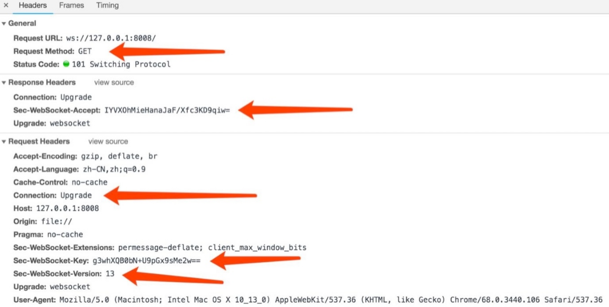
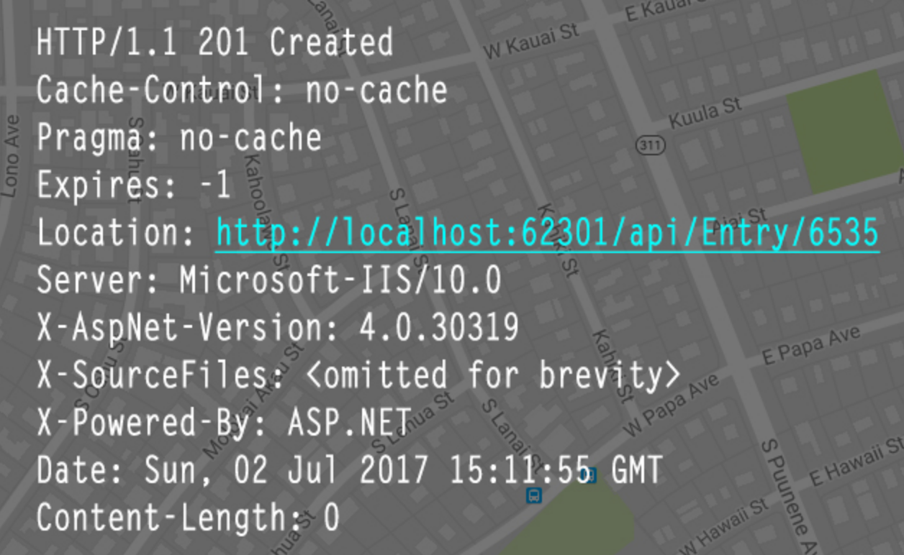
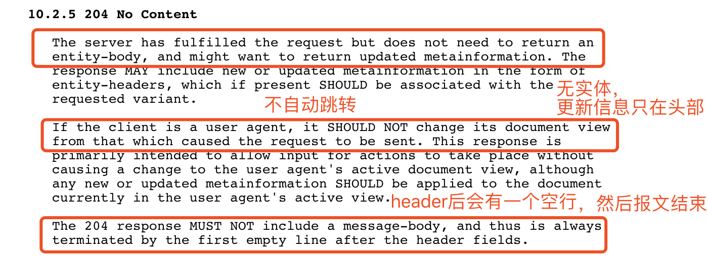
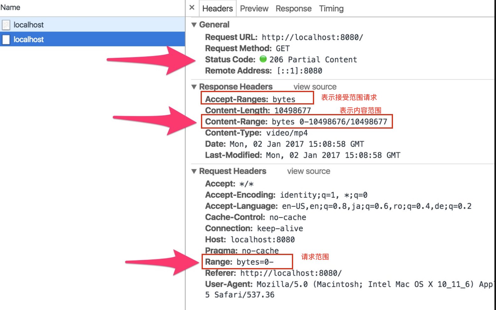
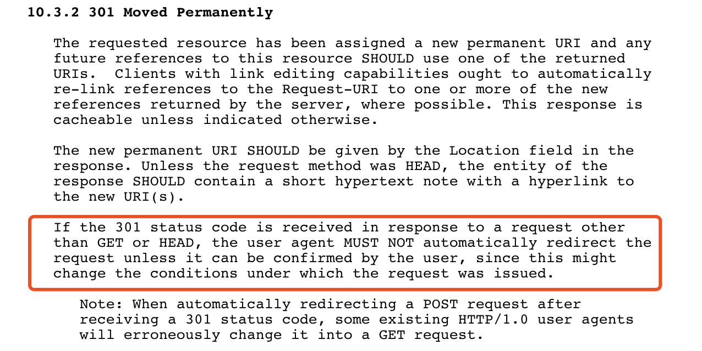
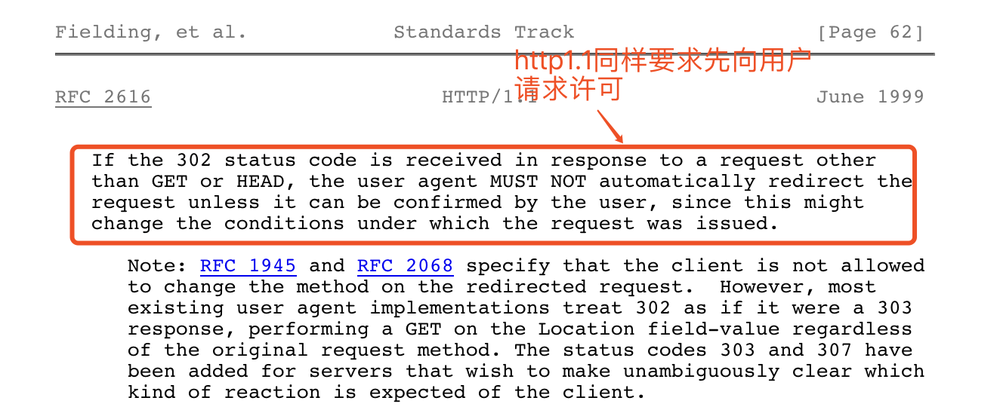

## HTTP->HTTPS HTTP协议是一个渣男👦-主动，不负责，不拒绝
从链路层⛓️到IP层再到TCP/UDP层，再到应用层。HTTP是我们经常使用的协议，一个小白，刚开始接触的就是HTTP协议。同时这个协议很容易被人忽略。做前端必须要熟悉HTTP协议，做后端就要知道HTTP协议到底怎么来的。怎么工作的，工作原理是什么。总结了一下，HTTP要讲的东西蛮多的，基本上环环相扣，从简单的HTTP到安全HTTPS，HTTP状态码，基于流的HTTP2.0，缓存技术等等。简单吗？不简单！复杂吗？超复杂。应用层协议一窝蜂，天天有不同，google开发了QUIC，文章最后，一起探讨QUIC。<br>
文章思路:HTTP首部请求与响应报文➡️HTTP状态码➡️GET与POST方法，PUT、DELETE➡️HTTP缓存机制➡️HTTP2.0➡️HTTPS➡️QUIC🔚
### HTTP随想
##### URL与URI 统一资源定位符©️与统一资源标识符©️
URI，用字符串标识某一互联网资源，而URL表示资源的地点(互联网上所处的位置)。<br>
#### HTTP 协议用于客户端和服务器端之间的通信
HTTP协议和TCP/IP协议族内的其他众多的协议相同，用于客户端和服务器之间的通信。怎么通信呢？HTTP先请求，发出请求报文，服务器响应这个请求并返回，这是个怎么样的过程呢？例如，在浏览器输入`"https://www.baidu.com"`，浏览器将这个域名发送给DNS服务器，DNS解析IP地址(后面会，另开一篇文章讲述DNS)，接下来，就是解析了IP地址，就到传输层TCP链接，剩下就是TCP的事情了。
#### HTTP是不保存状态的协议 不负责(从来都不做持久化处理) 渣男行为一
HTTP是一个无状态协议，它自身不对请求和响应之间的通信状态进行保存。使用HTTP协议，每当有新的请求发送时，就会有对应的新响应产生，协议本身并不保留之前一切或响应报文的信息。这是为了处理大量的事务，确保协议的可伸缩性，故意把HTTP协议设计得如此简单，明了。<br>
而且每次请求响应之后，TCP就断开了链接🔗，为了做这一点小事，TCP三次握手🤝四次回收🙋，有点付出和收获不成正比。那怎么着？
##### keep-alive保持持久链接🔗 HTTP1.1 旨在建立1⃣️次TCP链接后，进行多次请求和响应的交互
任意一端没有明确提出断开链接，则保持TCP链接状态。从慢启动到快速🔜发送，再到拥塞重启，再到快速重传策略，TCP就这样按部就班为客户端和服务端一直服务着。那么持久链接有什么好处呢？<br>
* 管线化: 多数请求发送，不一定要等待响应再发送请求(这个在HTTP2.0，稍后会重点讲一讲)

keep-Alive:timeout=15,max=100 表示15ms内无请求则断开，100ms后，一定断开<br>
前面讲得有点，emmm，笼统？接下来，要真正理解HTTP，要从HTTP的报文说起<br>
### HTTP请求 我请求做某事的时候，还是很有交代的
HTTP报文大概分为三大部分。第一部分是请求行，第二部分是请求的首部，第三部分是请求的正文实体。先来看看请求的格式。<br>


HTTP协议的请求和响应报文中必定包含HTTP首部。首部内容为客户端和服务器分别处理请求和响应提供所需要的信息。
##### HTTP请求报文 方法、URL、HTTP版本、HTTP字段等部分构成
在讲解报文之前，先来看一下浏览器抓取的报文<br>


请求报文头


从上图来看，在浏览器抓取的报文中，包括3⃣️种首部字段<br>
* 通用首部字段(General): 请求报文和响应报文两方都会使用的首部 但是上图并没有体现
* 响应首部字段(Response Headers): 从服务端向客户端返回🔙响应报文时使用的首部。补充了相应的附加内容，也会要求客户端附加额外的内容信息
* 请求首部字段(Request Headers): 从客户端向服务器端发送请求报文时使用的首部。补充了请求的附加内容、客户端信息、响应内容相关优先级
* 实体首部字段(Entity Header Fields): 针对请求报文和响应报文的实体部分使用的首部。补充了资源内通的更新时间等与实体相关的信息

介绍HTTP/1.1 首部字段:<br>
1⃣️首部通用字段解读<br>

首部字段名|说明
|--|--|
Cache-Control|控制缓存行为⚠️(这是客户端和服务器协商缓存处理，下面会持续说明)
Connection|逐跳首部、连接🔗管理
Date|创建报文的日期时间
Pragma|报文指令
Trailer|报文末端的首部一览
Transfer-Encoding|指定报文主体的传输方式
Upgrade|升级为其他协议
Via|代理服务器的相关信息
Warning|错误通知❌

2⃣️请求首部字段解读<br>

首部字段|说明
|--|--|
Accept|用户代理可处理的媒体类型
Accept-Charset|优先字符集
Accept-Encoding|优先内容编码
Accept-Language|优先语言
Authorization|Web认证信息
Expect|期待服务器的特定行为
From|用户的电子邮箱📮地址
Host|请求资源所在服务器
If-Match|比较实体标记(Etag)(Etag是一个重点的内容)
If-Modified-Since|比较资源的更新时间
If-None-Match|比较实体标记(与If-Match相反)
If-Range|资源未更新时发送实体Byte的范围请求
If-Unmodified-Since|比较资源的更新时间
Max-Forwards|最大传输逐跳数
Proxy-Authorization|代理服务器要求客户端的认证信息
Range|实体字体范围请求
Referer|对请求中的URI的原始获取方(原始)
TE|传输编码的优先级
User-Agent|HTTP客户端信息(这里搞一下伪造)

3⃣️响应首部字段解读<br>

首部字段|说明
|--|--|
Accept-Ranges|是否接受字节范围请求
Age|推算资源创建经过时间
ETag|资源匹配信息
Location|令客户端重定向至指定URI
Proxy-Authenicate|代理服务器对客户端的认证信息
Retry-After|对再次发起请求的时机要求
Server|HTTP服务器的安装信息
Vary|代理服务器缓存的管理信息
WWW-Authenticate|服务器对客户端的认证信息

4⃣️实体首部字段

首部字段|说明
|--|--|
Allow|资源可支持的HTTP方法
Content-Encoding|实体主体适用的编码方式
Content-Language|实体主体的自然语言
Content-Length|实体主体的大小
Content-Location|替代对应资源的URI
Content-MD5|实体主体的报文摘要
Content-Range|实体主体的位置范围
Content-Type|实体主体的媒体📺类型
Expires|实体主体过期的日期时间
Last-Modified|资源的最后修改日期时间

首部的字段一定有存在的意义的，不会无端端就会存在的。<br>
好了，首部的字段都简介完了，接下来讲讲 POST、GET、PUT与DELETE
##### HTTP请求方法 POST、GET、PUT与DELETE 满足增删查改
这几个方法，其实一个熟悉前端的，再熟悉不过。<br>
* GET: 去服务器获取一些资源。
```
request Header:
GET /index.html HTTP/1.1
Host:www.baidu.com

response Headers:
index.html
```

对于网页访问来讲，要获取的资源往往是一个页面📃。其实也有很多其他的格式，比如说返回一个JSON字符串，要返回什么，由服务器端决定。

* POST: 主动告诉服务端一些信息，而非获取。要告诉服务端什么呢？一般方法会有参数写明。一般会放在正文中。正文可以有各种各样的格式，常见JSON

```
request Header:
POST /index.html HTTP/1.1
Host:www.baidu.com
Content-Type:text/html
Content-Length:1880

response Headers:
返回index.html接受数据后的处理结果
```

* PUT: 向指定资源的位置上传最新内容。但是HTTP服务器往往是不允许上传文件的，所以PUT和POST就都编程了要传给服务器东西的方法
```
request Header:
PUT /index.html HTTP/1.1
Host:www.baidu.com
Content-Type:text/html
Content-Length:1880

response Headers:
HTTP/1.1 204 No Content 表示该html已经存在服务器上了
```

POST往往用来创建一个资源，而PUT往往是用来修改一个资源的<br>
举个🌰: ☁️云主机已经创建了，想打一个标签，说明这个☁️云主机是生产环境的，另外一个云主机是测试环境的。那怎么修改这个标签呢？往往用PUT。

* DELETE: 删除资源，要删除一个云主机，就用DELETE 返回状态码204 No Content

* OPTIONS: 针对URI指定的资源支持的方法
```
request Header:
OPTIONS * HTTP/1.1
Host:www.baidu.com

response Headers:
HTTP/1.1 200 OK
Allow: GET,POST,HEAD,OPTIONS...
```

* CONNECT: 要求用隧道协议连接代理。在与代理服务器通信时建立隧道，实现用隧道协议进行TCP通信。主要使用SSL(Secure Sockets Layer)和TLS(Transport Layer Security)协议把通信内通加密🔐后经网络隧道传输

```
CONNECT 代理服务器名: 端口号 HTTP版本

request header:
CONNECT proxy.ibm.com:8080 HTTP/1.1
Host:proxy.ibm.com

response header:
HTTP/1.1 200 OK
```
##### 面试官:谈谈GET和POST的区别？
um...何必呢？其实我们都知道，HTTP是基于TCP🔗链接的，所以所有的方法，都是可以自己写的，只不过基于标准我们一起定义了上述几种请求方法。所以对于GET和POST请求，上面的说法是正确的，都是从服务器上拿资源。看似GET只能某种获取资源，但是同样他也能告知服务器参数，已经需要的资源处理结果。POST同样，只不过，在万维网的世界里，GET请求做事要做出面在url上填参数，而POST就不会，而是把东西都放在肚子里，到了服务器端，再跟服务器说。当然，也可以在POST上的url填参数，不过这样做有点，暴露信息，何必呢?<br>

当然HTTP对GET和POST参数的传递渠道提出了要求(url或者request body)。GET请求比较苦逼，URL，也就是浏览器会限制🚫长度在2K个字节，而(大多数)服务器最多处理64K字节大小的url。超过部分，恕不处理(臣妾做不到啊！)。所以，要是在GET请求URL大量写入参数，服务器，处理不了...就GG，而且，URL也填不了那么多啊。如果使用request body，有些服务器会处理，但是有些服务器就直接忽略，根据get请求，服务器处理的方法也不同。<br>

所以我说，基于TCP连接的GET和POST其实没什么差别，只是HTTP标准让他们出现了差别。<br>
所以面试官错了吗？因为HTTP标准就这点区别？并不是，其实基于TCP连接， **GET会产生一个TCP数据包，POST会产生两个TCP数据包**<br>
* 对于GET方式的请求，浏览器会把http header和data一并发送出去，服务器响应200 OK返回数据。
* 对于POST方式请求，浏览器会先发送header，服务器响应100 continue，表示，来！我们可以发送数据了。浏览器再去亲吻服务器，服务器就响应200

因为POST需要两步，所以时间上会消耗一点，但是资源就不会被浪费。<br>
所以，这时候面试官会说什么，真棒👍<br>

##### HTTP状态码


从报文头，我们都能看到这个 status 200 ok，那究竟还有什么其他的状态码吗？多到你怀疑人生...🤨<br>

#### 1XX Informational 接收的请求正在处理(在忙呢在忙呢)
**100 Continue**<br>
* 行为: HTTP/1.1 协议里设计100状态码目的是，在客户端发送Request Message之前，HTTP/1.1协议允许客户端先判定服务器是否愿意接受客户端发来的消息主体(基于Request Headers)
* 含义: 即Client和Server在POST较大数据之前，允许双方”握手🤝“，如果匹配上了，Client才开始发送(较大)数据。这样降低资源开销。因为如果客户端直接发送请求数据，但是服务器又将该请求拒绝，这样，数据就浪费了。
* 操作: 如果预期等待100-continue的应答，那么它发的请求必须包含一个"Expect:100-continue"的头域


所以，客户端一般要发送较大的POST请求时，会先发一个100-continue的请求，就像上面说的那样。<br>

**101 Switching Protocols**<br>
表示访问当前资源需要更换协议进行数据传输<br>


#### 2XX 你的请求已经被服务器正确处理✅ (没问题🆗)
**200 🆗**<br>
请求被服务器成功处理，服务器会根据不同的请求方式返回结果<br>

**201 Created**<br>
请求已经被实现了，而且有一个新的资源已经依据请求的需求建立了，且其URI已经随Location头信息返回。<br>


**204 No Content**<br>
1⃣️服务器已经完成了处理，但是不需要返回响应体(no content)<br>
2⃣️与200状态，没有实体返回的区别在于，浏览器处理204的状态码，只是回去读取报文头的更新信息，若UA是一个浏览器，请求的时候 `<a href="xxx">`标签形式，204是不会发生页面跳转的。相对应的200会。<br>
RFC原文描述



**206 Partial Content**<br>
1⃣️表示客户端发起了范围请求，而服务器只对其中一部分的请求成功处理了<br>
2⃣️此时客户端请求，必须包含有range字段，而服务端报文中，必须包含有Content-Range指定的实体内容(entity)<br>



客户端发请求时对应的Range，服务器端响应时对应的是Content-Range<br>

Range字段含义:<br>
* bytes=SSS-RRR 有头有尾，表示S-R字节范围的内容 下载
* -RRR，表示最后RRR字节的内容 下载
* SSS-，表示从SSS字节开始到文件结束部分的内容 下载
* 0-0，-1，表示第一个和最后一个字节
* SSS1-RRR1,SSS2-RRR2同时指定几个范围 下载

Content-Range:<br>
用于响应头，在发出带Range的请求后，服务器会在Content-Range头部返回当前接受的范围和文件的总大小

```
Content-Range:bytes(unit first byte pos) - [last byte pos]/[entity length]

Content-Range:bytes 0-499/244242
```
0-499是指响应当前的请求数据范围，244242表示文件的总大小。响应完成后，返回的响应头内容也不同

```
HTTP/1.1 200 OK (不使用断点续传方式)
HTTP/1.1 206 Partial Content (使用断点续传方式)
```
会出现错误吗？传文件最容易出错！<br>
##### 增强校验
举个🌰 终端💻发起续传请求时，URL对应的文件内容服务端已经发生了变化，此时续传的数据肯定是错误的。如何解决这个问题呢？显然此时需要有一个标识文件唯一性的方法。<br>
在 RFC2616 中也有相应的定义，比如实现 Last-Modified 来标识文件的最后修改时间，这样即可判断出续传文件时是否已经发生过改动。同时 FC2616 中还定义有一个 ETag 的头，可以使用 ETag 头来放置文件的唯一标识。<br>
我们来看看文件发生变化之后会触动什么首部字段改变。要知道，首部字段就是告知两端信息的变化的。<br>

* Last-Modified: 与If-Modified-Since一样都是用于记录📝页面最后修改时间的HTTP头信息的。而Last-Modified是由服务器往客户端发送的HTTP头，而If-Modified-Since则是由客户端往服务器发送的头部信息。

可以看到，再次请求本地存在的缓存页面时， **客户端会通过If-Modified-Since头将先前服务器端发过来的Last-Modified最后修改时间戳发送回去** 这是为了让服务器端进行验证，通过这个时间戳判断客户端的页面是否最新，如果不是最新的，则返回新的内容，如果是最新的，则返回304 Not Modified，告诉客户端本地cache的页面是最新的。这样，客户端就可以直接从本地加载页面了，这样在网路上传输的数据就会大大减少，同时也减轻了服务器的负担。<br>

* Etag(Entity Tags): 主要为了解决Last-Modified无法解决的一些问题(什么问题？)

1. 一些文件也许会周期性更改，但是内容不变(仅仅修改了时间)，这时候，并不希望客户端会认为这个文件被改变了，而重新GET
2. 某些文件修改频繁，例如在秒以下的单位时间内修改了N次，而，If-Modified-Since能检查到的粒度是s级的，这种修改无法判断
3. 某些服务器不能精确得到文件的最后修改时间

`etag: "36BE3457520CDFD54CA910564E580EAE"` http/1.1引入Etag，唯一的标识，表示文件的版本。<br>

* If-Range: 判断实体是否发生改变，如果未改变，服务器发送客户端丢失的一部分，否则发送整个实体。一般格式

```
If-Range:Rtag|HTTP-Date

If-Range: "36BE3457520CDFD54CA910564E580EAE"
If-Range: Fri, 22 Feb 2019 03:45:02 GMT
```
也就是说，If-Range可以使用Etag或者Last-Modified返回的值。当没有Etag却有Last-Modified时，可以把Last-Modified作为If-Range字段的值<br>

If-Range必须与Range配套使用。如果请求报文中没有Range，那么If-Range就会被忽略。如果服务器不支持If-Range，那么Range就会被忽略掉。<br>

如果请求报文中的Etag与服务器目标内容的Etag相等，即没有发生变化，那么应答就是206。如果发生了变化，应答报文的状态码为200。<br>

其他用于增强校验的HTTP头信息: If-Match/If-None-Match、If-Modified-Since/If-Unmodified-Since

工作:Etag由服务器端生成，客户端通过If-Range条件判断请求来验证资源是否修改。<br>
➡️第一次请求:发起get，服务器处理请求，返回文件内容以及相应的header，其中包括Etag，状态码200
➡️第二次请求: 发起get，同时发送If-Range，服务端判断Etag和计算出来的Etag是否匹配，匹配206，不匹配200

为了保证资源可靠，首部字段也很给力。<br>

#### 3XX 服务器端已经接受到了请求，客户端必须对请求进行一些特殊的处理之后，才能顺利完成此处请求
**301 Move Permaneltly 永久重定向**<br>
301出现，表示请求的URL资源已经被分配了新的定位符，
* HEAD请求下，必须在头部Location字段中明确指出新的URI
* 除了有Location字段外，还需要在相应是体重，附上永久性的URI的连接文本
* 若是客户使用POST请求，服务端若是使用重定向，则需要经过客户同意
* 对于301来说，资源除非额外指定，否则默认都是可缓存的


⭕️实际场景，使用http访问一些https资源的时候，浏览器设置了自动重定向https，那么首次访问就会返回301状态码<br>

**302 Found 临时重定向**<br>

* 302临时重定向，只对本次的请求进行重定向
* 若用户将本URI收藏起来，不去修改书签🔖中的指向(只是暂时的)
* 重定向的时候，RFC规范规定，不会去改变请求的方式。但实际上，很多现存的浏览器都直接将302响应视为303响应，并且在重定向的时候，使用GET方式返回报文中Location字段指明的URL
* 对于资源缓存，只有Cache-Control或Expires中进行了指定的情况下，这个响应才是可缓存的


⭕️实际场景:使用网站端地址，访问的时候就会临时重定向到我们压缩前地址指向的页面<br>

**303 See Other存在着另一个资源URI(重定向)**<br>
* 表明用户请求的资源，还存在着另一个URI，其实也是重定向的含义


**304 Not Modified**<br>
这个乱入的状态码，硬生生成了HTTP界的一股清流。他与重定向无关。表示1⃣️本次请求命中了缓存策略，客户端可以直接从本地缓存中取出内容2⃣️304状态码返回时，不包含任何响应的主体部分<br>


**307 Temporary Redirect**<br>
* HTTP/1.1文档中307状态码相当于HTTP1.0文档中的302状态码
* 当客户端的POST受到服务端的307响应时，需要跟用户询问是否应该在新的URI发起POST方法。307准讯浏览器标准，不会将POST改为GET。

http1.0和http1.1都规定，若客户端发送的是非GET或者HEAD请求，响应头中携带301或302的时候，浏览器不会自动进行重定向，而是需要询问用户，因此此时请求的情况已经发生了变化<br>

301,RFC文档说明:



302,RFC http1.0文档说明


302,RFC http1.1文档说明



但是⭕️实际场景，所有的浏览器都会默认把POST请求直接改为GET请求<br>
301会将就网址替换后重定向的网址，而302则会保留就有的网页内容<br>

#### 4XX 表明客户端是发生错误的原因所在(❌)
**400 BAD REQUEST**<br>
1⃣️表示该请求报文中`存在语法错误`，导致服务器无法理解该请求。客户端需要修改请求的内容后再次发送请求<br>
2⃣️一般也可以用于用户提交的表单内容不完全正确，服务端也可以用400享用客户


**401 UNAUTHORIZED未授权**<br>
1⃣️该状态码表示发送的请求需要有通过HTTP认证<br>
2⃣️当客户端再次请求该资源的时候，需要在请求头中的Authorization包含认证信息<br>

验证失败返回401


客户端主动提供Authorization信息


3⃣️www-authenticate:Basic表示一种简单的，有效的用户身份认证技术<br>

##### Basic 验证过程简述
1⃣️客户端访问一个受http基本认证保护的资源<br>
2⃣️服务器返回401状态码，要求客户端提供用户名和密码进行认证(验证失败的时候，响应头会加上WWW-Authenticate Basic realm="请求域")

```
401 Unauthorized
WWW-Authenticate:Basic realm="wallyworld"
```
3⃣️客户端将输入的用户名密码用Base64进行编码后，采用非加密的明文方式传送给服务器

```
Authorization:Basic xxxxxxxxx
```
4⃣️服务器将Authorization头中的用户名密码并取出，进行验证，如果验证成功，则返回相应的资源。如果认证失败，则仍返回401状态，要求重新进行认证<br>

**403-FORBIDDEN**<br>
1⃣️该状态码明显被服务器拒绝了❌<br>
2⃣️服务器没有必要给出拒绝的详细理由，但如果想做说明的话，可以在实体的主体部分原因进行描述<br>
3⃣️未获得文件系统的访问权限，访问权限出现某些问题，从未授权的发送源IP地址试图访问等情况都有可能发生403响应<br>

**404-Not Found**<br>
无法找到指定资源，通常也被服务端用户表示不想透露请求失败原因<br>

**405 Method Not Allowed**<br>
表示该资源不支持该形式的请求方式，在Response Header中返回Allow字段，携带支持的请求方式<br>


**412 Precondition Failed**<br>
在请求报文中的If-xxx字段发送到服务端后，服务端发现没有匹配上。比如 If-Match:asfdfasfsd，希望匹配ETag值<br>


#### 5XX表示服务器本身发生错误
**500 Internal Server Error**<br>
表示服务器端在处理客户端请求的时候，服务器内部发生了错误(以前遇到这个问题都是代码出错了)


**502Bad GateWay**<br>
1⃣️表示连接服务器的边界路由器出问题，导致不能到达(就网关路由出错)<br>


**503 Service Unavaliable**<br>
1⃣️该状态码表示服务器已经处于一个超负荷的一个状态，或者所提供的服务暂时不能够正常使用<br>
2⃣️若服务器端能够事先得知服务恢复时间，可以在返回503状态码的同时，把恢复时间写入Retry-After字段中<br>
3⃣️要是没有Retry-After，那么客户端会把这个状态码处理成500<br>

好了，讲了POST，GET等请求和状态码以及首部字段，接下来该讲缓存机制了。篇幅有限，下文继续讲。<br>
