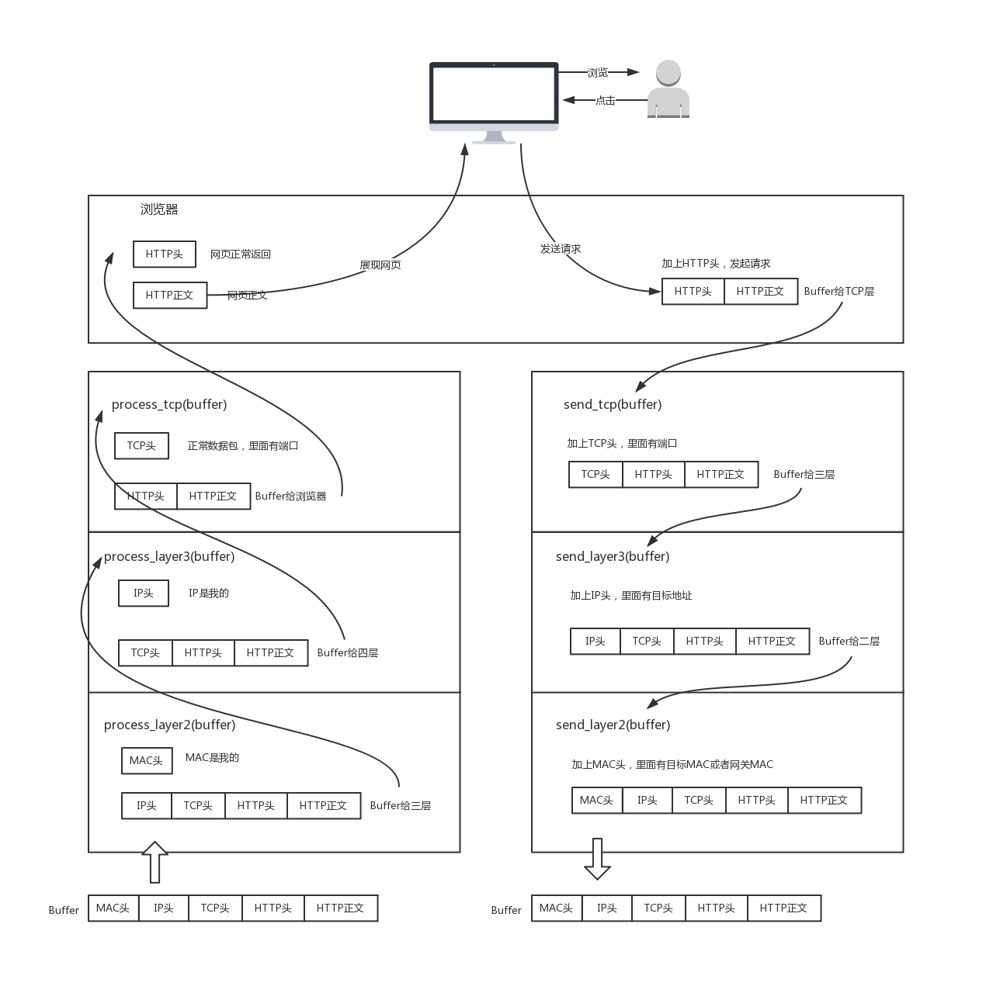

## TCP/IP
根据网课以及阅读tcp详解做的总结。>_<!!!本来不想做了，就是脑袋不争气，老忘记。 
今天来探讨以下网络为什么要分层。 
### 网络为什么要分层？
其实这是一个很好的问题，大多数tcp/ip的书只是说明网络是有层次的，可以分为第一层应用层，第二层传输层，第三层网络层，第四层数据链路层，第五层物理层。但是为什么要分层呢？为什么会分为这几层呢？ 
一个网络数据包，必须是一个健全的数据包，跑起来才能快过刘翔。数据包无论经过那个设备都必须是完整，所以当一个请求从终端发起的时候(应用层)发起的时候，例如http请求，这个请求的正文就会被包上一个http头，然后就会给到下一层传输层，传输层就会给数据包上tcp的头，tcp就会记录下源端口号和目的端口号，紧接着发给ip层（网络层）网络层就会给你包上ip头，记录源ip地址和目标ip地址，紧接着就会发到mac层（数据链路层），mac层就会给数据包包上mac头，记录源mac地址和目的mac地址。(还要看目标mac地址是不是知道的，知道就直接加上去，不知道就吼一下(通过一定的协议处理)。) 
所以通过上面我们知道，每一层都需要工作，而且这是一个复杂的程序，每一层都有不同的处理方式，所以这是一个层层封装的概念，如果没有层层封装，整个数据包我们认为是不完整的。 
 
### 怎么查看ip地址呢？
ifconfig(linux)。ipconfig(windows)。 
还有其他命令吗？有，linux(ip addr)。 
 
ip是地址，有定位功能。因为mac只能在网络号内通信，如果跨子网就需要依靠ip地址的定位功能。
#### CIDR 弥补A,B,C,D,E类地址不够用的问题
* 将ip地址一分为二。网络号和主机号 
10.100.122.2/24计算网络号，广播地址，子网掩码。AND运算(注意这里24) 
10.100.122.2/22计算网络号，广播地址，子网掩码。AND运算(注意这里22) 
D类地址是组播地址，也就是224-239。 
环回接口127.0.0.1，通过查看ip addr可以看到这个回环地址lo->loopback 
MAC地址只是一个电脑的身份证。没有两个重复的身份证。（但是虚拟世界不一样） 
CIDR可以通过计算判断一下是不是同一个网络号的。 
IP分为共有IP和私有IP。 
MTU最大的传输单元（MAX TRANSFER UNIT)，看到ip addr里面是1500的字符，就是不能超过1500个字节传输。 
qdisc就是queueing discipline，排队规则。按照FIFO方式通过队列传送。 
### 那ip怎么来的？又是怎么没的？ DHCP与PXE
ip又叫做网际协议。他是怎么来的呢？我们又是怎样通过ip就可以上网了？ 
先来认识一下这个动态主机配置协议(Dynamic Host Configuration Protocol)->DHCP，靠吼(arp)给你分ip 
DHCP Discover-> DHCP Offer(DHCP Server)->DHCP Request->DHCP ACK(DHCP Server)。 
PXE服务器(客户端)，自己装操作系统。 